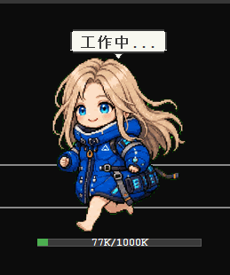

# Claude Pet — 桌面宠物



Claude Code 动画桌面宠物，通过 hooks 实时同步 AI 工作状态。

## 当前宠物

| 宠物 | 目录 |
|------|------|
| Diana | `assets/diana/` |
| Miss Minute | `assets/miss-minute/` |
| Frieren | `assets/frieren/` |
| Homelander | `assets/homelander/` |

## 快速开始

```bash
# 一键启动
python scripts/pet_launch.py

# 或在 Claude Code 中输入 /pet
```

> `desktop_pet.py` 需要 `--atlas` 参数，日常使用请用 `pet_launch.py`。

### 重启
```bash
taskkill /F /IM python.exe
python scripts/pet_launch.py
```

## 功能

### 操作
| 操作 | 方式 |
|------|------|
| 拖拽移动 | 左键拖拽（左右拖拽触发跑步动画） |
| 切换状态 | 双击循环切换 |
| 右键菜单 | 状态选择、宠物切换、漫游开关、聊天感知、提示音、退出 |

### 聊天感知

宠物通过 hooks 同步 Claude Code 工作状态：

| 事件 | 状态 | 气泡 |
|------|------|------|
| UserPromptSubmit | thinking | "正在思考..." |
| PreToolUse | thinking | "正在思考..." |
| PostToolUse | running | "工作中..." |
| Stop | waving | "完成！" + 提示音 |
| SessionEnd | idle | — |

### 上下文条

宠物底部显示当前会话 token 用量，颜色随使用率变化（绿 <60%，黄 60-85%，红 >85%）。事件驱动更新，对话完成后 1 秒刷新。

## 制作宠物

每个状态一个 GIF 即可合成精灵图集：

```bash
python scripts/compose_gif_atlas.py \
  --gifs-dir <GIF目录> --output <输出目录> --name <宠物名>
```

GIF 命名：`<宠物名>-<状态>.gif`

## 精灵图集规格

| 属性 | 值 |
|------|-----|
| 网格 | 8 列 × 9 行 |
| 帧尺寸 | 192 × 208 px |
| 图集尺寸 | 1536 × 1872 px |

| 行 | 状态 | 描述 |
|----|------|------|
| 0 | idle | 待机 |
| 1 | running-right | 向右跑 |
| 2 | running-left | 向左跑 |
| 3 | waving | 挥手 |
| 4 | jumping | 跳跃 |
| 5 | failed | 失败 |
| 6 | waiting | 等待 |
| 7 | running | 原地跑 |
| 8 | review | 审查 |

## 依赖

- Python 3.10+
- Pillow (`pip install Pillow`)
- tkinter（Windows/macOS 自带）
